# Welcome to ParallelIQ 👋

### 🚀 Automating AI Infrastructure with Predictive Orchestration & Compiler Intelligence

  
  
  
  
  

---

## 🧠 Who We Are

**ParallelIQ** is a model-aware control-plane company building the next generation of infrastructure for AI and LLM workloads.

We sit above Kubernetes and Slurm — bringing intent, policy, economics, and observability together to make GPU-native AI systems efficient, governable, and scalable.

We believe the future of AI isn’t just smarter models — it’s **infrastructure that understands the models it runs**.

🏗 What We Build

- 📐 Open standards for **declarative AI model intent** (ModelSpec / UMIR)
- 🧭 **Control-plane workflows** for admission, placement, and lifecycle management
- 🔍 **Runtime introspection** tools for GPU fleets (utilization, MFU, fragmentation)
- 💰 **Economic visibility** for GPUaaS providers (idle, stranded, underutilized GPUs)
- ⚡ **Optimization of GPU efficiency**, KV cache behavior, and serving performance
- 🛡 **Governance, policy enforcement, and operational guardrails** for AI systems

---

## 🗂️ Open Source Projects

### 🔍 [piqc](https://github.com/paralleliq/piqc) — PIQC Fact Collector
> *Kubernetes scanner that discovers LLMs running on vLLM and extracts their deployment and runtime facts.*

A Kubernetes-native introspection CLI that automatically discovers **vLLM inference deployments**, collects GPU metrics, runtime telemetry, and generates standardized **ModelSpec** documentation. Built for ML Eng, MLOps, and SRE teams.

`Python` · `Kubernetes` · `vLLM` · `GPU Metrics` · `ModelSpec`

---

### 📄 [modelspec](https://github.com/paralleliq/modelspec) — Open Declarative AI Model Specification
> *An open, declarative specification for describing how AI models are deployed, served, and operated in production.*

ModelSpec captures **execution, serving, and orchestration intent** — making implicit assumptions explicit in a machine-readable, human-auditable format. Runtime-agnostic. Cloud-agnostic. Built for real-world teams.

`JSON Schema` · `LLM Deployment` · `AI Infrastructure` · `MLOps` · `Observability`

---

### 📚 [piqc-knowledge-base](https://github.com/paralleliq/piqc-knowledge-base) — Production Readiness Standards for GenAI
> *Production-ready checklists and frameworks for deploying LLMs, GenAI models, and AI infrastructure.*

A neutral, community-driven collection of **deployment checklists**, **infrastructure best practices**, **runtime diagnostics**, and **governance frameworks**. Covers vLLM, Kubernetes, GPU optimization, observability, compliance, and Day-0 to Day-2 operations.

`AI Infrastructure` · `vLLM` · `Kubernetes` · `GPU Optimization` · `AI Governance`

---

## 🛠️ Tech Stack & Focus Areas

  
    
    
    
    
    
   
  

---

## GitHub Analytics  

  
    
    

  

## Activity Graph  

---

## 📬 Let's Connect

📨 **Business Inquiries:** [sam@paralleliq.ai](mailto:sam@paralleliq.ai)  
👤 **Founder & CEO:** Sam Hosseini  
🌐 **Website:** [paralleliq.ai](https://paralleliq.ai)

---

---

> *Making AI deployment knowledge open, neutral, and accessible to everyone.*  
> **ParallelIQ**
