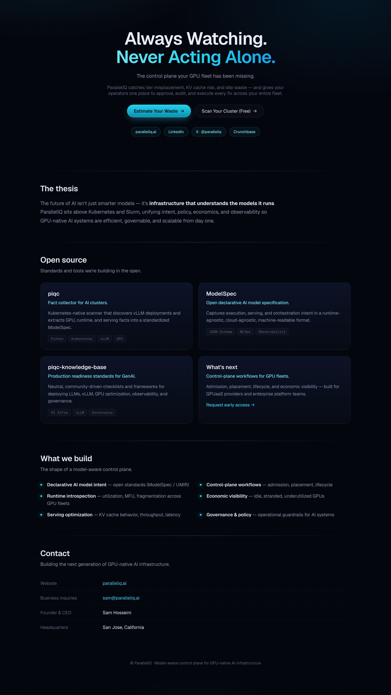

  

  
  

  
  
  
  

---

## Open source

- **[piqc](https://github.com/paralleliq/piqc)** — Kubernetes-native fact collector for AI clusters. Discovers vLLM deployments and extracts GPU, runtime, and serving facts into a standardized ModelSpec.
- **[ModelSpec](https://github.com/paralleliq/modelspec)** — Open declarative AI model specification. Captures execution, serving, and orchestration intent in a runtime-agnostic, cloud-agnostic, machine-readable format.
- **[piqc-knowledge-base](https://github.com/paralleliq/piqc-knowledge-base)** — Production readiness standards for GenAI. Neutral, community-driven checklists for deploying LLMs, vLLM, GPU optimization, observability, and governance.

---

## Contact

| | |
|---|---|
| **Website** | [paralleliq.ai](https://paralleliq.ai) |
| **Business inquiries** | [sam@paralleliq.ai](mailto:sam@paralleliq.ai) |
| **Founder & CEO** | Sam Hosseini |
| **Headquarters** | San Francisco, California |

© ParallelIQ · Building the next generation of GPU-native AI infrastructure

